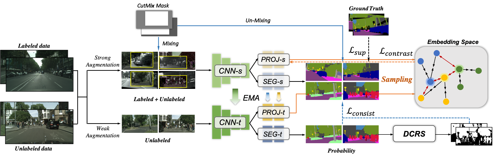

# C3-SemiSeg:Contrastive Semi-supervised Segmentation via Cross-set Learning and Dynamic Class-balancing
[](https://opensource.org/licenses/MIT) 

<!-- TOC -->

  - [Requirements](#requirements)
  - [Training](#training)
  - [Inference](#inference)
  - [Code structure](#code-structure)
  - [Config file format](#config-file-format)
  - [Acknowledgement](#acknowledgement)

<!-- /TOC -->

This repo contains a PyTorch an implementation of $C^3$-SemiSeg: Contrastive Semi-supervised Segmentation via Cross-set Learning and Dynamic Class-balancing.



### Todo: 
Clean up and re-check the code.

## Requirements
PyTorch and Torchvision needs to be installed before running the scripts, together with `PIL` and `opencv` for data-preprocessing and `tqdm` for showing the training progress. PyTorch v1.4 is supported (using the new supported tensoboard).
Other packages please see in `requirement.txt`.  

```bash
pip install -r requirements.txt
```

or for a local installation

```bash
pip install --user -r requirements.txt
```

In addition, ImageNet pretrain weights are needed before running the training script.
Please modify the pre-train path in `models/pretrain.py` to your weight path.

Then, download the dataset according to the path in `config/config-contrastive.json`. By default, the path of Cityscapes dataset should be like:
```angular2html
--------/root/dataset/cityscapes
                        |--------gtFine/{SPLIT}/{CITY}/*_gtFine_labelIds.png # label
                        |--------leftImg8bit/{SPLIT}/{CITY}/*.png #image
```
## Training
```bash
sh scripts/train_ssl.sh
```

## Inference
For inference, we need a PyTorch trained model, the images we'd like to segment and the config used in training (to load the correct model and other parameters), 

```bash
python test.py --config config.json --model best_model.pth
```

## Code structure

  ```
  pytorch-template/
  │
  ├── train.py - main script to start training
  ├── inference.py - inference using a trained model
  ├── trainer/
  │        ├──Ctrainer.py - the main trained
  |        └── write your own trainer here
  ├── config/
  │       ├──config-contrastive.json - holds configuration for training
  │       └── write your own config
  ├── base/ - abstract base classes
  │   ├── base_dataloader.py
  │   ├── base_model.py
  │   ├── base_dataset.py
  │   ├── base_trainer.py
  │   └── sampler.py - support  IterDistributedSampler   (random sample in distributed mode with predefined number) 
  │
  ├── dataloader/ - loading the data for different segmentation datasets
  │           ├──transforms.py - all the augmentations are writed here.
  │
  ├── models/ - contains semantic segmentation models
  │
  ├── saved/
  │   ├── runs/ - trained models are saved here
  │   └── log/ - default logdir for tensorboard and logging output
  │  
  └── utils/ - small utility functions
      ├── losses.py - losses used in training the model
      ├── checkpoint.py - help function to handle checkpoint
      ├──  dist_util.py - help function for distributed training
      ├──  helpers.py
      ├── logger.py - logger class
      ├── misc.py 
      ├── palette.py - color for dataset
      ├── torchsummary.py - help function to print torch env
      ├── transforms.py - only use in visual
      ├── metrics.py - evaluation metrics used
      └── lr_scheduler - learning rate schedulers 

  ```

## Config file format
Config files are in `.json` format:
```javascript
{
    "name": "DeepLabV2-contrastive",         // training session name
    "n_gpu": 1,               // number of GPUs to use for training.
    "use_synch_bn": true,     // Using Synchronized batchnorm (for multi-GPU usage)
    "sync_group_nums": 1,  // group number for sync BN
    "arch": {
        "type": "DeepLabV2", // name of model architecture to train
        "args": {
            "backbone": "resnet101",    // encoder type type
            "pretrain_from": "imagenet", // which pretrain weight be used
            "freeze_bn": false,         // When fine tuning the model this can be used
            "freeze_backbone": false    // In this case only the decoder is trained
            "return_feat_and_logit": false // whether the model return both feature dict and prediction, true for contrastive learning(automatic update in train.py)
        }
    },
    "contrastive": {
        "embed_dim": 256, //output dimemsion of projection head
        "contrastive_loss_weight": 1.0,
        "rampup": 1000, //warmup for contrastive loss
        "start_epoch": 10,
        "temperature":0.15,
        "p_head": "mlp" // projection head
    },
    "train_loader": {
        "type":  "CityScapes",          // Selecting data loader
        "args":{
            "data_dir":"../dataset/cityscapes",  // dataset path
            "batch_size": 4,     // batch size
            "base_size": 1024,  // The image is resized to base_size, then other transforms
            "crop_size": [256, 512], // size to crop
            "num_samples": 4000, // samples in each epoch, num_samples = iter_per_epoch * batch_size
            "augment": true,      // Use data augmentation
            "shuffle": true,
            "scale": false,        // Random rescaling between 0.5 and 2 before croping
            "flip": true,         // Random H-FLip
            "rotate": true,       // Random rotation between 10 and -10 degrees
            "blur": false,         // Adding a slight amount of blut to the image
            "split": "train", // Split to use, depend of the dataset
            "num_workers": 8,
            "end_percent": 0.4, // threshold for dynamic class balanced threshold, 0.4 means threshold is the value of top 40% samples in one class
            "color_jitter": 0, // intensity of color jittering
            "random_grayscale": 0, 
            "gaussian_blur": 0, // kernel size for blur
            "high": 512, // resize high in build_transform
            "scale_list": [1.0] // random scale range, [1.0] means no scaling, 
                                // notice, if we use RandomScale in build transform, then [a,b] means random.choice(a,b) to scale,
                                // if we use RandomRangeScale, then [a,b] means s = random.uniform(a,b), and scale s.
        }
    },

  "unlabel_loader": {
        "type": "PseudoCityScapes",  // Selecting data loader for unlabeled data
        "args":{
            "data_dir": "../dataset/cityscapes",
            "batch_size":4,
            "base_size": 1024,
            "crop_size": [256, 512],
            "num_samples": 4000,
            "augment": true,
            "shuffle": true,
            "scale": false,
            "flip": true,
            "rotate": true,
            "blur": false,
            "split": "train",
            "num_workers": 8,
            "end_percent": 0.8,
            "color_jitter": 1.0,
            "random_grayscale": 0,
            "gaussian_blur": 0,
            "autoaug": false,
            "high": 512,
            "scale_list": [1.0],
            "siam_weak": false,
            "siam_strong": false
        }
    },


    "val_loader": {// Same for val, but no data augmentation
        "type": "CityScapes",
        "args":{
            "data_dir": "../dataset/cityscapes",
            "batch_size": 6,
            "base_size": 1024,
            "crop_size": false,
            "val": true,
            "split": "val",
            "num_workers": 4,
            "end_percent": 0.4,
            "high": 512,
            "scale_list": [1.0]
        }
    },
    "optimizer": {
        "type": "Adam",
        "differential_lr": true,  Using lr/10 for the backbone, and lr for the rest

        "args":{
            "lr":2.5e-3,
            "weight_decay": 5e-4,
            "momentum": 0.9
        }
    },


    "loss": "CrossEntropyLoss2d",     // Loss (see utils/losses.py)
    "ignore_index": 255,              // Class to ignore (must be set to -1 for ADE20K) dataset
    "lr_scheduler": {   
        "type": "Poly",               // Learning rate scheduler (Poly or OneCycle)
        "args": {"iters_per_epoch": 1000  // iters in each epoch, e.g. sampler prepares 4000 indexs in each epoch, 
                                          // batch size=4, therefore, iters_per_epoch = 4000/4=1000 
}
    },

    "trainer": {
        "cutmix": false,    // whether to use cutmix for SSL
        "epochs": 40,       // Number of training epochs
        "save_dir": "saved/",  // Checkpoints are saved in save_dir/models/
        "save_period": 40, // Saving chechpoint each 10 epochs
        "cb_threshold": false,
        "monitor": "max Mean_IoU", // Mode and metric for model performance 
        "early_stop": 200,  // Number of epochs to wait before early stoping (0 to disable)
        "rampup":1000,
        "tensorboard": true, // Enable tensorboard visualization
        "log_dir": "saved/runs",
        "log_per_iter": 20,
        "pretrain_path": ".",
        "val": true,
        "val_per_epochs": 1,// Run validation each 1 epochs
        "consist_weight": 50,
        "ema": false, // whether to use ema to update teacher weight
        "ema_alpha": 0.99 , //update ratio
        "unlabel_start_epoch": 10, //which epoch to start unlabeled data training
        "contrastive": true, //whether to use contrastive
        "gamma": 0.0 // hypers in IAST, if gamma>0, the class with average less confidence will be given a smaller ratio for threshold. default 0.
    }

}
```
## Acknowledgement

This repository utilizes the code from

 [https://github.com/yassouali/pytorch-segmentation](https://github.com/yassouali/pytorch-segmentation). 
 [https://github.com/tfzhou/ContrastiveSeg](https://github.com/tfzhou/ContrastiveSeg)
 